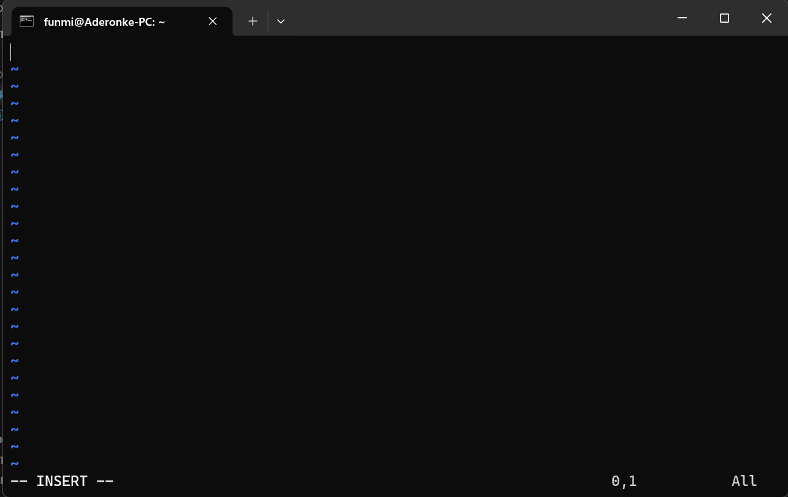
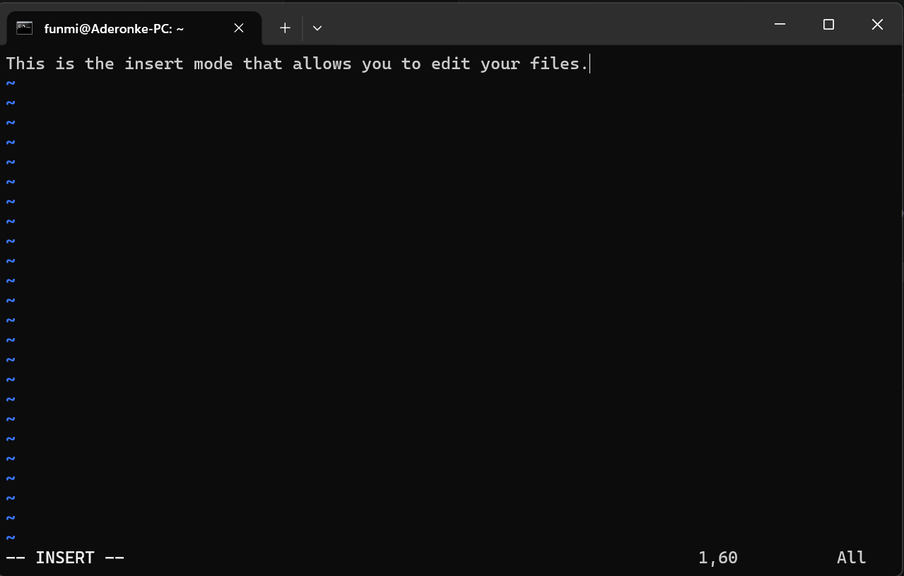
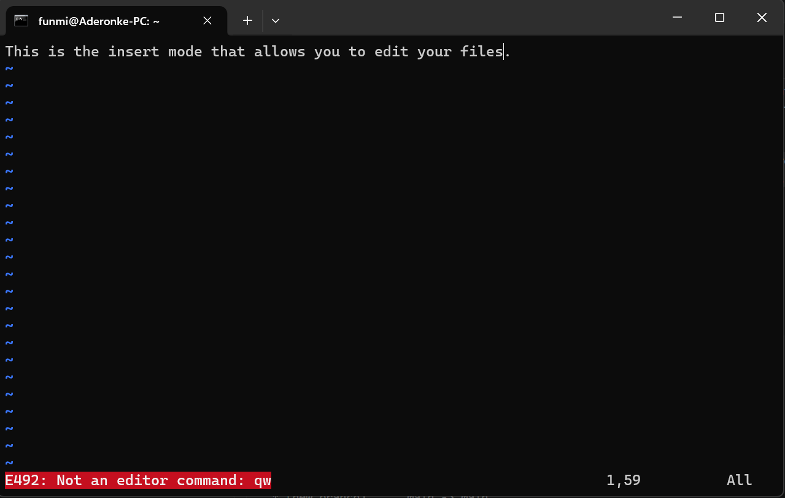
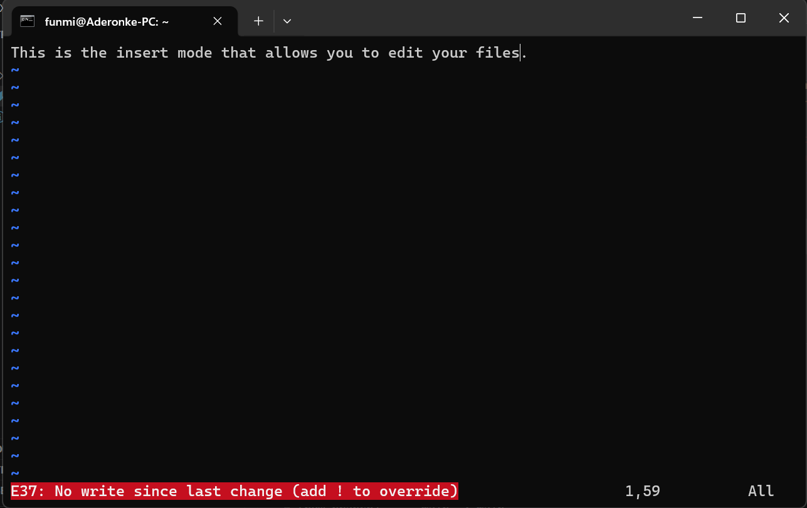

# How to use the VIM editor

Vi or VIM editors are used to write to a file from the command line. Vi is the original built-in text editor in Linux. It is small, simple, and available on almost every Unix/Linux system.

Vim stands for Vi IMproved. It is a modern, enhanced version of Vi that adds many productivity features to Vi. Vim mostly doesn't come installed. 

A key difference between these two is that Vi has basic editing features while Vim, on the other hand, adds syntax highlighting, auto-indentation, multiple undo/redo, search improvement, plugins, e.t.c.

## Using VIM
1. **Installing VIM:** Depending on the linux distribution that you are using ( I have a debian distribution), you will use any of the two commands below:

> sudo apt install vim
>
> sudo yum install vim

2. **Open a new file:** You can open existing files or new files with vim. Either way, you use:

> vim **filename**

filename here could be an existing file or a new one. If the file didn't exist before you used the command, vim will open the new file for you.

Note that when vi or vim first opens your file, you are presented with the command mode. Vim/Vi editor has two modes:

a. *Command mode:* This is the default mode that you are automatically presented when you use the command above. In this mode, you can't edit anything instead, whatever you type is treated as a command. So, you have to be sure of what you are doing in this mode. This allows you to navigate, search, delete, e.t.c.

b. *Insert mode:* this mode allows you to edit the text file. You are allowed to type into your file using different character combinations.

3. **Switching from command to insert mode:** To switch to insert mode that allows you to type in your words, press the `i` key. In this mode, you are able to edit your file and afterwards, save it.

4. **Saving your work:** After you have edited your file, you need to save before exiting the file so as to persist the data you have stored on it. To do this, you have to switch back into the command mode first. Press the `Esc` key to switch first. Then, use these key combinations to save your work:

`:` `w` `q` `Enter` which stands for write and quit. Note that if you do `q` before `w`, isn't a recognized command. You should write before quitting (think of it in that way). 

If you encounter any of this error by not using the correct character sequence, just retype them and you'll get the result you want.

5. **Discard changes to a file without saving:** Use the keys, `:` `q` `!`.

6. **Deleting a line in the command mode:** You can use the key combination: `dd` in the command mode to delete a whole line of words instead of deleting character by character in the insert mode.

7. **Removing several lines:** You can achieve this by using: `d` `5` - if you are removing 5 lines. Or `d` `10` for ten lines. Basically `d` and the number of lines that follow each other that you want to delete and if you want to undo the lines that you deleted, press the `u` key. The `u` key allows you to undo the other changes you had made if you keep pressing it.

8. **Jumping to the end of a line:** Instead of using the arrow key to move right to the end of a line, you can just press upper case `A` with the `Shift` `a` keys from the command mode. However, this key sequence does not only take you to the end of the line, it also switches to insert mode. However, if you don't want to be switched into the insert mode after getting to the end of the line, use the `$` key instead.

9. **Jumping to the beginning of the line:** This is achieved by typing `0` as in the zero key.

10. **Jumping to a specific line number:** You can do this by the tying: `line-number` `G`. For example: If you need to go to line 120 in a file, type: `120G` which stands for go to line 120.

11. **To search for a string of words in a file:** You can do this by using the `/` (forward slash)key and the word or string of characters you are looking for. e.g. `/open`.

12. **Navigating through the matches in the forward slash search:** From the search in number 11 above, if you have more than one matches of the word or string of characters you searched for, you can toggle between all of the words by pressing the `n` key for next word or go backwards to the previously viewed result with upper case `N`.

13. **Renaming/replacing certain words with another one:** to replace a word for example, `display` with another word, `show` in a document, use the following keys: `:` `%` `s` `/` `display` `/` `show`. i.e. `:%s/old/new`.

